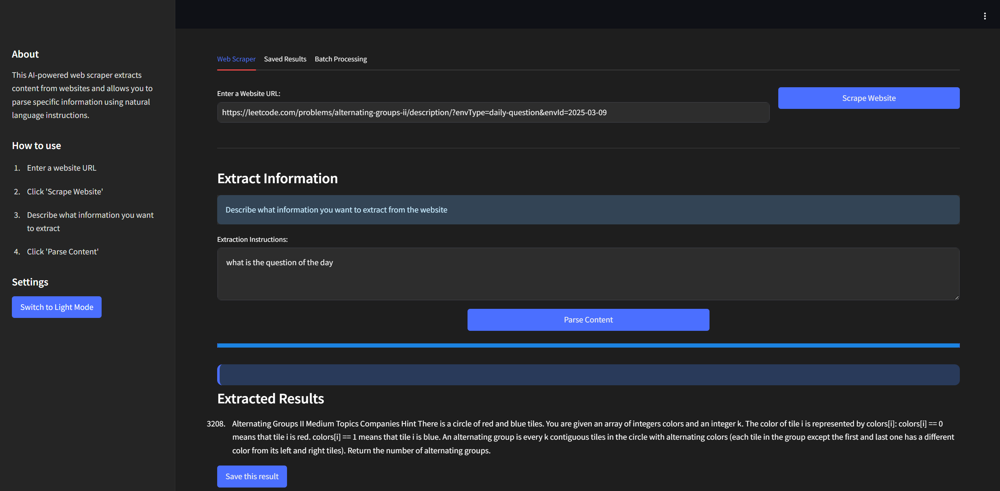
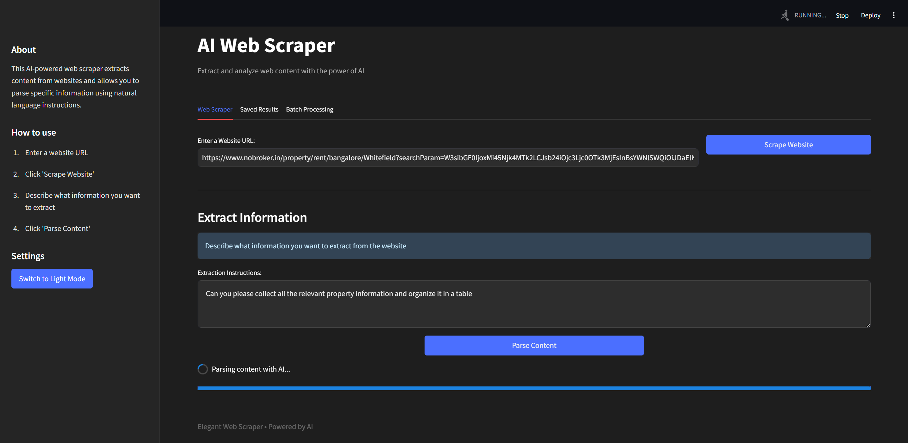
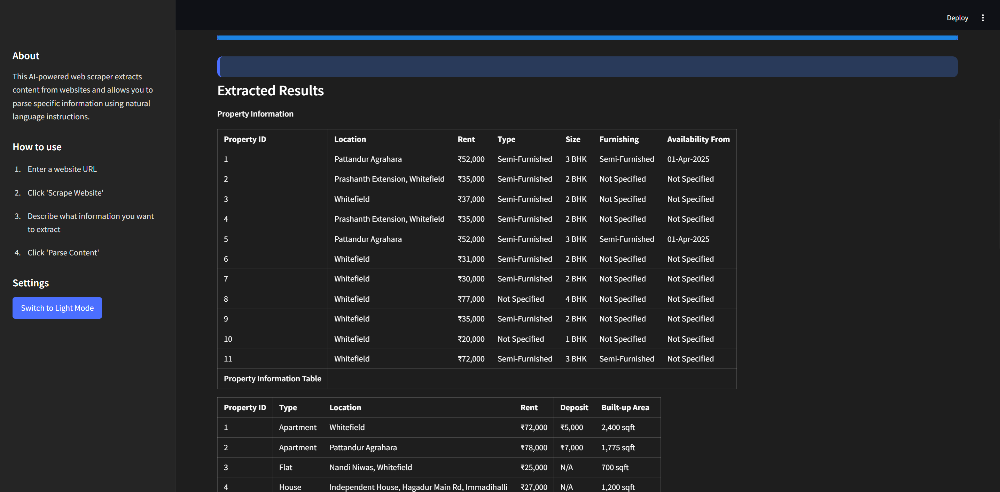
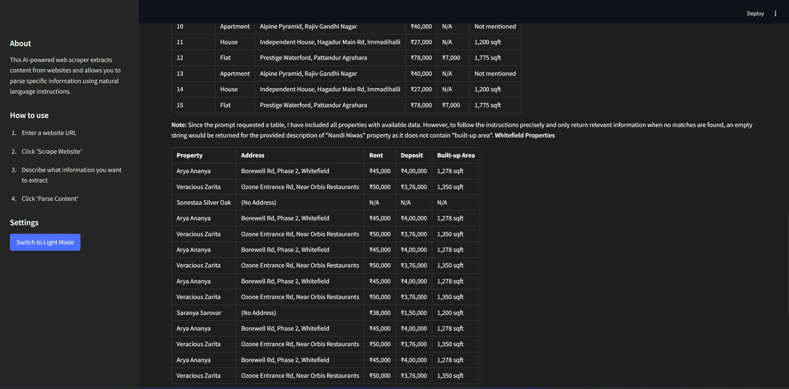
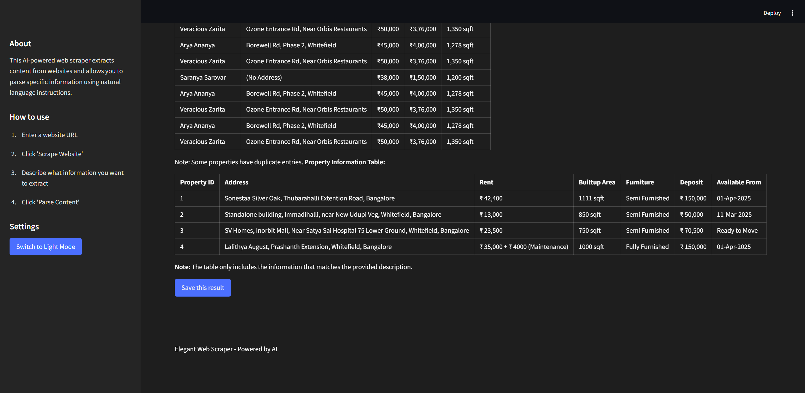
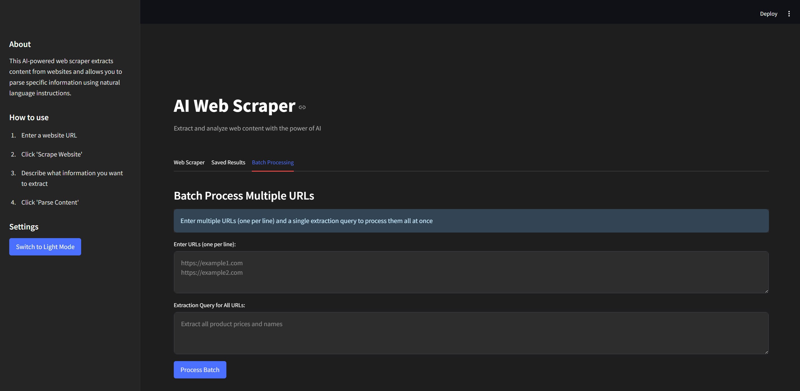
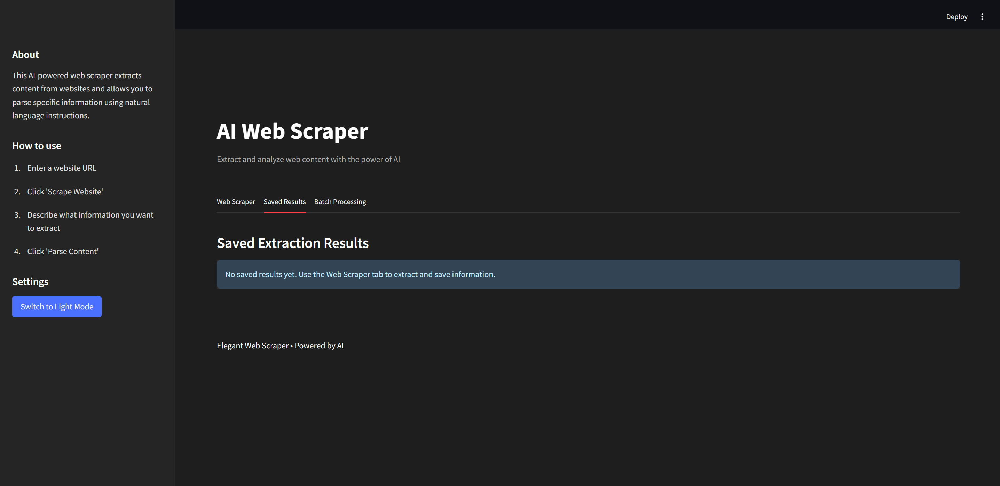

# AI Web Scraper

A powerful and elegant web scraping application with AI-powered content extraction capabilities. This tool allows you to scrape websites, extract specific information using natural language instructions, and process multiple URLs in batch mode.

## Features

- **Web Scraping**: Extract content from any website with a simple URL input
- **AI-Powered Parsing**: Describe what information you want in natural language
- **Dark/Light Mode**: Comfortable viewing experience in any environment
- **Search History**: Keep track of your previous extraction queries
- **Saved Results**: Store important extraction results for later reference
- **Batch Processing**: Process multiple URLs with a single query

## Screenshots

### Question of the Day from Leetcode



### Scraping NoBroker and Summarizing results of Whitefield Bangalore in a table






### Batch Processing



### Saved Results



## Installation

1. Clone this repository:
```bash
git clone https://github.com/Adiiii77/WEB-SCRAPER-USING-AI.git
cd ai-web-scraper
```

2. Install the required dependencies:
```bash
pip install -r requirements.txt
```

3. Install Ollama:
```bash
# On macOS or Linux
curl -fsSL https://ollama.com/install.sh | sh

# On Windows
# Download from https://ollama.com/download
```

4. Pull the Llama 3.1 model:
```bash
ollama pull llama3.1
```

5. Run the application:
```bash
streamlit run app.py
```

## How to Use

### Basic Scraping
1. Enter a website URL in the input field
2. Click "Scrape Website"
3. Wait for the scraping process to complete
4. Enter a natural language description of what information you want to extract
5. Click "Parse Content"
6. View your results and optionally save them

### Batch Processing
1. Navigate to the "Batch Processing" tab
2. Enter multiple URLs (one per line)
3. Write a single extraction query that applies to all websites
4. Click "Process Batch"
5. Review results and save if desired

## Technologies Used

- **Streamlit**: For the web application framework
- **Ollama**: For AI-powered content parsing
- **Llama 3.1**: Large language model for extracting structured information
- **Bright Data Scraping Browser**: For enhanced web scraping capabilities with anti-bot protection bypass
- **Python**: Core programming language

## Advanced Configuration

### Bright Data Integration

This application uses Bright Data's Scraping Browser to bypass captchas and other anti-scraping measures. To use this feature, ensure your Bright Data credentials are properly configured in the application.

## Limitations

- The application stores results in session state, meaning they will be lost if the server restarts
- Extremely complex websites with heavy JavaScript rendering might not be parsed perfectly
- Extraction quality depends on the clarity of your natural language instructions

---

Created with ❤️ by Aditya Rai
